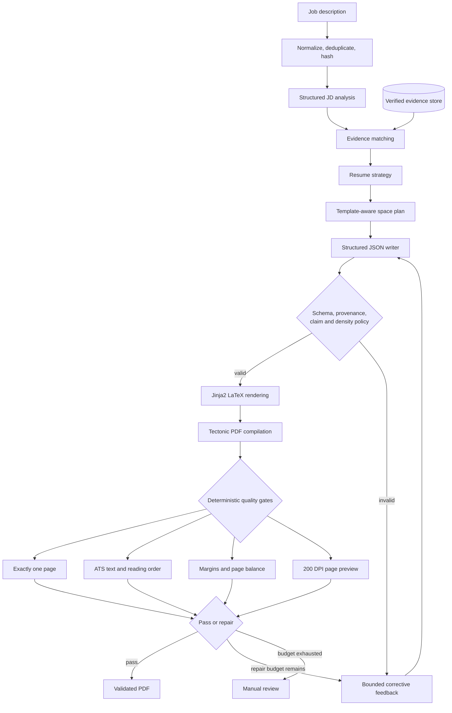

<div align="center">

# TITAN

### Self-Correcting AI Resume Compiler

**Evidence-grounded resume writing, deterministic PDF validation, and bounded repair for exactly one-page resumes.**

[](https://github.com/simon-derock/Titan-resume/actions/workflows/ci.yml)
[](https://www.python.org/)
[](https://docs.astral.sh/uv/)
[](#verification)

[Architecture](#architecture) · [Quality gates](#quality-gates) · [Templates](#resume-templates) · [Setup](#local-setup) · [Roadmap](#project-status)

</div>

---

TITAN is not a generic text-to-resume generator. It treats resume creation as a
constrained document-compilation problem:

- every claim must trace to verified candidate evidence;
- content is planned against a template-aware physical space budget;
- a deterministic content manifest fixes experience coverage and requested
  project/skill counts before the model writes prose;
- the model returns typed JSON, never raw LaTeX;
- a locked Jinja2 template produces the document source;
- Tectonic compiles the PDF in restricted mode; and
- deterministic validators can reject the result for page count, ATS reading
  order, unsafe geometry, or poor page utilization.

The result is a reproducible pipeline designed to create a truthful, tailored,
ATS-readable resume that is **exactly one page**.

> [!IMPORTANT]
> TITAN is under active development. The deterministic document pipeline and
> bounded repair executor are implemented. Vision critique, a live Telegram
> polling entry point, and human-in-the-loop checkpointing remain roadmap work.

## Why TITAN

Most resume generators stop after producing plausible prose. TITAN validates
the artifact recruiters and ATS systems actually receive: the compiled PDF.

| Design goal | TITAN's approach |
|---|---|
| Truthful content | Every summary, entry, skill, and bullet carries one or more evidence IDs. |
| One-page output | Page count is a hard deterministic veto, not a model preference. |
| ATS compatibility | Extracted text, required sections, and template-aware reading order are validated. |
| Safe layout | PDF text boxes are measured against explicit top, bottom, and horizontal margin policies. |
| Rich targeting | Structured JD requirements drive evidence ranking, strategy, and content selection. |
| Inventory coverage | All verified experiences are mandatory; projects and skills use exact manifest counts. |
| Controlled generation | Pydantic schemas, line budgets, entry limits, and claim policies constrain model output. |
| Recoverable failures | Validation defects are converted into targeted feedback inside a bounded repair loop. |
| Secure rendering | Candidate text is escaped, Jinja runs in a sandbox, and Tectonic runs cache-only and untrusted. |

## Architecture



The current executor is a typed, pure-Python state machine with injected
collaborators. It preserves a clean boundary for future LangGraph checkpointing
and Telegram human-in-the-loop orchestration without coupling those concerns to
document generation.

### Compilation path

```text
StructuredJobDescription
  → evidence matches
  → deterministic content manifest (counts and source slots)
  → ResumeStrategy
  → ResumeSpaceBudget
  → ResumeContent (validated JSON)
  → Jinja2 LaTeX template
  → Tectonic PDF
  → page + ATS + geometry validation
  → first-page PNG
```

## Quality gates

A resume is accepted only when all implemented hard gates pass.

| Gate | Enforcement |
|---|---|
| Evidence provenance | Rejects unknown, disallowed, omitted, or unavailable evidence references. |
| Claim policy | Rejects unsupported restricted terms, foreign roles, raw LaTeX, and invented URLs. |
| Space policy | Enforces section, entry, bullet, line, and physical bullet-length ceilings. |
| Compilation | Uses fixed subprocess arguments, no shell, a timeout, and typed failure results. |
| Page count | Requires one parsed PDF page; overflow is fatal. |
| ATS extraction | Requires non-empty extractable text and expected sections in logical order. |
| Geometry | Measures all page edges and rejects unsafe margins or excessive bottom whitespace. |
| Preview | Renders page one to an A4-ratio PNG at 200 DPI for artifact inspection. |
| Repair limit | Allows a bounded number of correction attempts, then returns `needs_review`. |

Deterministic measurements always outrank model advice. Future vision output is
advisory and will not be allowed to override page, provenance, ATS, or geometry
failures.

### Content manifest

The writer does not decide which history disappears. Before model generation,
TITAN creates a manifest containing every verified experience and education
source, a JD-ranked project selection, and a verified skill inventory. The
default policy keeps all experiences, selects up to five projects, and chooses a
template-fit JD-ranked slice from the complete verified skill inventory. Deedy
defaults to 80 skills, matching the reviewed handmade density; other templates
use smaller measured caps. Callers
can request exact project or skill counts with `ResumeContentRequirements`; a
request larger than verified evidence or the selected template's physical
capacity fails explicitly instead of silently dropping content.

```python
from app.models import ResumeContentRequirements

state = executor.run(
    raw_jd_text=jd_text,
    header=header,
    evidence_records=evidence,
    output_dir=Path("output"),
    template_id="deedy_cv_v1",
    requirements=ResumeContentRequirements(project_count=5, skill_count=40),
)
```

Descriptions, bullets, ordering, and skill grouping remain JD-tailored; source
identity, evidence grounding, hyperlinks, and manifest counts are deterministic
constraints.

## Resume templates

TITAN ships three reviewed A4 production templates. They share a full-width
identity header, normalized clickable contact links, a dynamic summary, and
template-specific space budgets.

| Template ID | Display name | Layout | Intended use |
|---|---|---|---|
| `resume_v1` | TITAN ATS | Single column | Conservative ATS-first applications and linear reading order. |
| `moderncv_two_column_v1` | ModernCV Two Column | Two column | Dense, polished technical presentation using stable article primitives. |
| `deedy_cv_v1` | Deedy CV | Two column | High-information engineering resumes with strong visual hierarchy. |

All three templates compile under Tectonic 0.16.9 and are covered by real PDF,
one-page, ATS-text, hyperlink, and geometry integration tests.

The ModernCV adaptation is derived from an LPPL-1.3c reference. The Deedy
adaptation retains Apache-2.0 provenance. Original reference files are kept in
[`latex_templates/`](latex_templates/) for attribution and are not used at
runtime.

## Local setup

### Prerequisites

- Python 3.11 or newer
- [`uv`](https://docs.astral.sh/uv/)
- Poppler utilities: `pdfinfo`, `pdftotext`, and `pdftoppm`
- Tectonic 0.16.9 at `.tools/tectonic`
- Linux x86-64 for the pinned compiler bootstrap shown below

### 1. Install Python dependencies

```bash
git clone https://github.com/simon-derock/Titan-resume.git
cd Titan-resume
uv sync --extra dev --locked
```

On Debian or Ubuntu, install the PDF inspection tools with:

```bash
sudo apt-get update
sudo apt-get install --yes poppler-utils curl
```

### 2. Provision the verified compiler

The repository's CI uses a pinned Tectonic archive and verifies its SHA-256
digest before extraction.

```bash
mkdir -p .tools
curl -fL --retry 3 \
  --output /tmp/tectonic-0.16.9-x86_64-unknown-linux-gnu.tar.gz \
  https://github.com/tectonic-typesetting/tectonic/releases/download/tectonic%400.16.9/tectonic-0.16.9-x86_64-unknown-linux-gnu.tar.gz
echo "f3c825128095dc3399ea11c08c18035b33050a216930c295c79e8eb11bd21de4  /tmp/tectonic-0.16.9-x86_64-unknown-linux-gnu.tar.gz" \
  | sha256sum --check --strict
tar -xzf /tmp/tectonic-0.16.9-x86_64-unknown-linux-gnu.tar.gz -C .tools
```

Warm the exact package and font surface once, then production compilation can
remain cache-only:

```bash
XDG_CACHE_HOME="$PWD/.tools/tectonic-cache" \
  .tools/tectonic --untrusted --keep-logs --outdir /tmp \
  tests/fixtures/compiler_warmup.tex
```

### 3. Configure local secrets

```bash
cp .env.example .env
```

Settings use the `TITAN_` prefix:

```dotenv
TITAN_ADMIN_TELEGRAM_IDS=[123456789]
TITAN_GEMINI_API_KEY=replace-with-a-local-secret
```

The Gemini key is optional for deterministic development. Live model tests are
excluded from the default suite. Never commit `.env`, candidate source
documents, generated resumes, or private evidence.

## Verification

Run the complete offline suite without making model or vision calls:

```bash
uv run pytest -m "not live_llm and not live_vision" -q
```

Run every repository quality gate:

```bash
make quality
```

The quality target runs tests, Ruff linting, formatting checks, strict mypy, and
the persistent-memory consistency check. CI additionally runs branch coverage
with a 90% minimum and provisions the verified compiler from scratch.

### Test layers

```text
tests/
├── unit/         pure policies, models, validation, planning, and routing
├── contract/     prompt, provider, schema, template, and compiler boundaries
├── integration/  real LaTeX, PDF, ATS, geometry, screenshot, and link checks
├── regression/   sourced AI Engineer JD benchmark expectations
└── fixtures/     compiler warmup documents and public-safe benchmark inputs
```

Live tests must be requested explicitly:

```bash
uv run pytest -m live_llm -q
uv run pytest -m live_vision -q
```

Run the fixed AI Engineer benchmark with private candidate inputs:

```bash
uv run python -m scripts.evaluate \
  --header-file data/private/candidate_header.json \
  --evidence-file data/candidate_evidence.json \
  --template-id deedy_cv_v1
```

The command stores each JD's artifacts under `outputs/evaluation/artifacts/`
and writes stable aggregate metrics to `outputs/evaluation/report.json`.

## Repository layout

```text
app/
├── graph.py                 bounded generation and repair executor
├── models.py                strict Pydantic domain contracts
├── prompts/                 versioned JSON-only model prompts
└── services/
    ├── jd.py                JD ingestion and structured analysis
    ├── matching.py          conservative evidence matching
    ├── strategy.py          truthful content selection
    ├── planning.py          template-aware page budgets
    ├── writing.py           grounded structured writer
    ├── rendering.py         safe LaTeX, Tectonic, and PNG boundaries
    ├── validation.py        page, ATS, and geometry gates
    ├── pipeline.py          deterministic artifact pipeline
    └── telegram.py          private authorization and service boundary
templates/                   locked production Jinja2 LaTeX templates
latex_templates/             attributed design references only
tests/                       unit, contract, integration, and regression tests
scripts/evaluate.py          typed live benchmark and JSON report command
TITAN_PLAN.md                product and engineering source of truth
memory.md                    current decisions, status, and next action
```

## Project status

| Capability | Status |
|---|---|
| Typed models and configuration | Complete |
| Restricted LaTeX-to-PDF vertical slice | Complete |
| Candidate evidence store and provenance | Complete |
| Structured JD analysis and evidence intelligence | Complete |
| Grounded structured resume writer | Complete |
| Three production resume templates | Complete |
| Bounded deterministic repair executor | Complete |
| Five-JD AI Engineer regression benchmark | Complete |
| First-page screenshot rendering | Complete |
| Vision critic and structured visual report | Planned |
| Live Telegram polling and approval controls | Planned |
| LangGraph checkpointed HITL workflow | Planned |
| Public evaluation report and demo artifacts | In progress |

The immediate quality objective is to outperform the designated handmade resume
on evidence richness, JD relevance, ATS extraction, working hyperlinks,
typography, alignment, and page utilization before expanding the Telegram
surface.

## Engineering principles

TITAN follows a strict **RED → GREEN → REFACTOR → VERIFY → DOCUMENT** loop.

- Production behavior begins with an observed failing test.
- Feature history preserves separate test-first and implementation commits.
- LLM responses are untrusted until they pass strict schemas and policies.
- Raw model-generated LaTeX is forbidden.
- Repair loops are bounded.
- Default CI never calls a live model.
- Candidate evidence and credentials remain private by default.

The full product contract, quality policy, milestones, and Definition of Done are
maintained in [`TITAN_PLAN.md`](TITAN_PLAN.md). Current engineering state and
decision history are maintained in [`memory.md`](memory.md).

## Security and privacy

- Candidate-controlled text is deterministically escaped before LaTeX rendering.
- Jinja2 uses a sandboxed environment with strict undefined-variable handling.
- Compiler subprocesses use fixed argument lists and never invoke a shell.
- Tectonic runs with `--untrusted --only-cached` for resume compilation.
- Evidence stores expose only records explicitly allowed for resume use.
- Provider failures are sanitized before surfacing from bounded retry layers.
- Secrets, private evidence, candidate PDFs, and generated artifacts must remain
  outside version control.

## Acknowledgements

- [Tectonic](https://tectonic-typesetting.github.io/) for reproducible TeX compilation
- [Jinja](https://jinja.palletsprojects.com/) for structured template rendering
- [Pydantic](https://docs.pydantic.dev/) for strict runtime contracts
- [Deedy CV](https://github.com/deedy/Deedy-Resume) by Debarghya Das
- [ModernCV](https://github.com/moderncv/moderncv) and the attributed two-column reference design

---

<div align="center">

**TITAN compiles evidence into a resume—and validates the page, not just the prose.**

</div>
